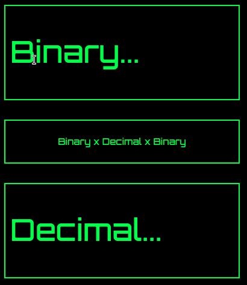

# Binary vs Decimal Converter
**Bin to Dec** is a simple way to convert binary to decimal and vice versa.

---

### Usage

---

## :computer: Used Technologies
- HTML5
- CSS3
- JavaScript
- Regex

---

## Demo 

[BinToDec XP](https://cesardmn.github.io/bin_to_dec/)

### inspired by [app-ideas](https://github.com/florinpop17/app-ideas/blob/master/Projects/1-Beginner/Bin2Dec-App.md)

